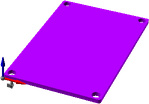
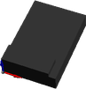

# Vitamin Catalogue

## 3DRRadio()

 * Filename: vitamins/3DRRadio.scad
 * Title of default part: 3DR Radio

## APM25()

 * Filename: vitamins/APM25.scad
 * Title of default part: APM 2.5

## ball_bearing(BB624)

 * Filename: vitamins/ball_bearing.scad
 * Title of default part: Ball Bearing 624

## Breadboard(Breadboard_170)

 * Filename: vitamins/Breadboard.scad
 * Title of default part: Breadboard 170

## ESC()

 * Filename: vitamins/ESC.scad
 * Title of default part: ESC

## FTDIBreakout()

 * Filename: vitamins/FTDIBreakout.scad
 * Title of default part: Sparkfun FTDI Breakout

## GPS()

 * Filename: vitamins/GPS.scad
 * Title of default part: GPS Module

## JumperWire(type=JumperWire_MM2, length=100)

 * Filename: vitamins/JumperWire.scad
 * Title of default part: JumperWire Male to Male 2pin 100mm

## MicroServo()

 * Filename: vitamins/MicroServo.scad
 * Title of default part: 9g Micro Servo

## NeopixelRing()

 * Filename: vitamins/NeopixelRing.scad
 * Title of default part: Neopixel Ring 16

## nut(type=M4_nut,nyloc=false,brass=false )

 * Filename: vitamins/nut.scad
 * Title of default part: M4 Nut

## screw(type=M4_cap_screw,length=20, hob_point=0 )

 * Filename: vitamins/screw.scad
 * Title of default part: M4 cap screw x 20mm

## washer(type=M4_washer)

 * Filename: vitamins/washer.scad
 * Title of default part: M4 Washer 9x0.8

## WFLYReceiver()

 * Filename: vitamins/WFLYReceiver.scad
 * Title of default part: WFLY Receiver

