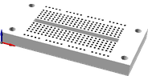
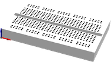
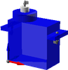

# Vitamin Catalogue

## vitamins/3DRRadio.scad

Title | Call | Image
--- | --- | ---
3DR Radio | `3DRRadio()` | 

## vitamins/APM25.scad

Title | Call | Image
--- | --- | ---
APM 2.5 | `APM25()` | 

## vitamins/ball_bearing.scad

Title | Call | Image
--- | --- | ---
Ball Bearing 623 | `ball_bearing(BB623)` | 
Ball Bearing 624 | `ball_bearing(BB624)` | 
Ball Bearing 608 | `ball_bearing(BB608)` | 
Ball Bearing 625_2RS | `ball_bearing(BB625_2RS)` | 
Ball Bearing 6205_2RS | `ball_bearing(BB6205_2RS)` | 

## vitamins/Breadboard.scad

Title | Call | Image
--- | --- | ---
Breadboard 170 | `Breadboard(Breadboard_170)` | 
Breadboard 270 | `Breadboard(Breadboard_270)` | 
Breadboard 400 | `Breadboard(Breadboard_400)` | 

## vitamins/ESC.scad

Title | Call | Image
--- | --- | ---
ESC | `ESC()` | 

## vitamins/FTDIBreakout.scad

Title | Call | Image
--- | --- | ---
Sparkfun FTDI Breakout | `FTDIBreakout()` | 

## vitamins/GPS.scad

Title | Call | Image
--- | --- | ---
GPS Module | `GPS()` | 

## vitamins/JumperWire.scad

Title | Call | Image
--- | --- | ---
JumperWire Male to Male 2pin 100mm | `JumperWire(type=JumperWire_MM2, length=100)` | 

## vitamins/MicroServo.scad

Title | Call | Image
--- | --- | ---
9g Micro Servo | `MicroServo()` | 

## vitamins/NeopixelRing.scad

Title | Call | Image
--- | --- | ---
Neopixel Ring 16 | `NeopixelRing()` | 

## vitamins/nut.scad

Title | Call | Image
--- | --- | ---
M2 Nut | `nut(type=M2_nut,nyloc=false,brass=false )` | 
M2.5 Nut | `nut(type=M2p5_nut,nyloc=false,brass=false )` | 
M3 Nut | `nut(type=M3_nut,nyloc=false,brass=false )` | 
M4 Nut | `nut(type=M4_nut,nyloc=false,brass=false )` | 
M5 Nut | `nut(type=M5_nut,nyloc=false,brass=false )` | 
M6 Nut | `nut(type=M6_nut,nyloc=false,brass=false )` | 
M6 Half Nut | `nut(type=M6_half_nut,nyloc=false,brass=false )` | 
M8 Nut | `nut(type=M8_nut,nyloc=false,brass=false )` | 
M10 Nut | `nut(type=M10_nut,nyloc=false,brass=false )` | 

## vitamins/screw.scad

Title | Call | Image
--- | --- | ---
M2 pan screw x 20mm | `screw(type=M2_pan_screw,length=20, hob_point=0 )` | 
M2.5 pan screw x 20mm | `screw(type=M2p5_pan_screw,length=20, hob_point=0 )` | 
M2.5 cap screw x 20mm | `screw(type=M2p5_cap_screw,length=20, hob_point=0 )` | 
M3 cap screw x 20mm | `screw(type=M3_cap_screw,length=20, hob_point=0 )` | 
M3 pan screw x 20mm | `screw(type=M3_pan_screw,length=20, hob_point=0 )` | 
M3 hex screw x 20mm | `screw(type=M3_hex_screw,length=20, hob_point=0 )` | 
M3 grub screw x 20mm | `screw(type=M3_grub_screw,length=20, hob_point=0 )` | 
M4 cap screw x 20mm | `screw(type=M4_cap_screw,length=20, hob_point=0 )` | 
M4 pan screw x 20mm | `screw(type=M4_pan_screw,length=20, hob_point=0 )` | 
M4 hex screw x 20mm | `screw(type=M4_hex_screw,length=20, hob_point=0 )` | 
M4 grub screw x 20mm | `screw(type=M4_grub_screw,length=20, hob_point=0 )` | 
M5 cap screw x 20mm | `screw(type=M5_cap_screw,length=20, hob_point=0 )` | 
M6 cap screw x 20mm | `screw(type=M6_cap_screw,length=20, hob_point=0 )` | 
M6 selftap screw T25 x 20mm | `screw(type=M6_selftap_screw,length=20, hob_point=0 )` | 
M8 cap screw x 20mm | `screw(type=M8_cap_screw,length=20, hob_point=0 )` | 
M8 hex screw x 20mm | `screw(type=M8_hex_screw,length=20, hob_point=0 )` | 
M10 cap screw x 20mm | `screw(type=M10_cap_screw,length=20, hob_point=0 )` | 
M5 low profile screw x 20mm | `screw(type=M5_lowprofile_screw,length=20, hob_point=0 )` | 
No2 pan wood screw x 20mm | `screw(type=No2_screw,length=20, hob_point=0 )` | 
No4 pan wood screw x 20mm | `screw(type=No4_screw,length=20, hob_point=0 )` | 
No6 pan wood screw x 20mm | `screw(type=No6_screw,length=20, hob_point=0 )` | 
No6 cs  wood screw x 20mm | `screw(type=No6_cs_screw,length=20, hob_point=0 )` | 
6-32 pan screw x 20mm | `screw(type=No632_pan_screw,length=20, hob_point=0 )` | 

## vitamins/washer.scad

Title | Call | Image
--- | --- | ---
M2 Washer 6x0.5 | `washer(type=M2_washer)` | 
M2.5 Washer 5.9x0.5 | `washer(type=M2p5_washer)` | 
M3 Washer 7x0.5 | `washer(type=M3_washer)` | 
M3.5 Washer 8x0.5 | `washer(type=M3p5_washer)` | 
M4 Washer 9x0.8 | `washer(type=M4_washer)` | 
M5 Washer 10x1 | `washer(type=M5_washer)` | 
M5 Washer 20x1.4 | `washer(type=M5_penny_washer)` | 
M6 Washer 12x1.5 | `washer(type=M6_washer)` | 
M8 Washer 17x1.8 | `washer(type=M8_washer)` | 
M8 Washer 30x1.5 | `washer(type=M8_penny_washer)` | 
M10 Washer 21x2.2 | `washer(type=M10_washer)` | 
M3 Rubber Washer 10x1.5 | `washer(type=M3_rubber_washer)` | 

## vitamins/WFLYReceiver.scad

Title | Call | Image
--- | --- | ---
WFLY Receiver | `WFLYReceiver()` | 

## vitamins/wingnut.scad

Title | Call | Image
--- | --- | ---
Wingnut M4 | `wingnut(M4_wingnut)` | 

